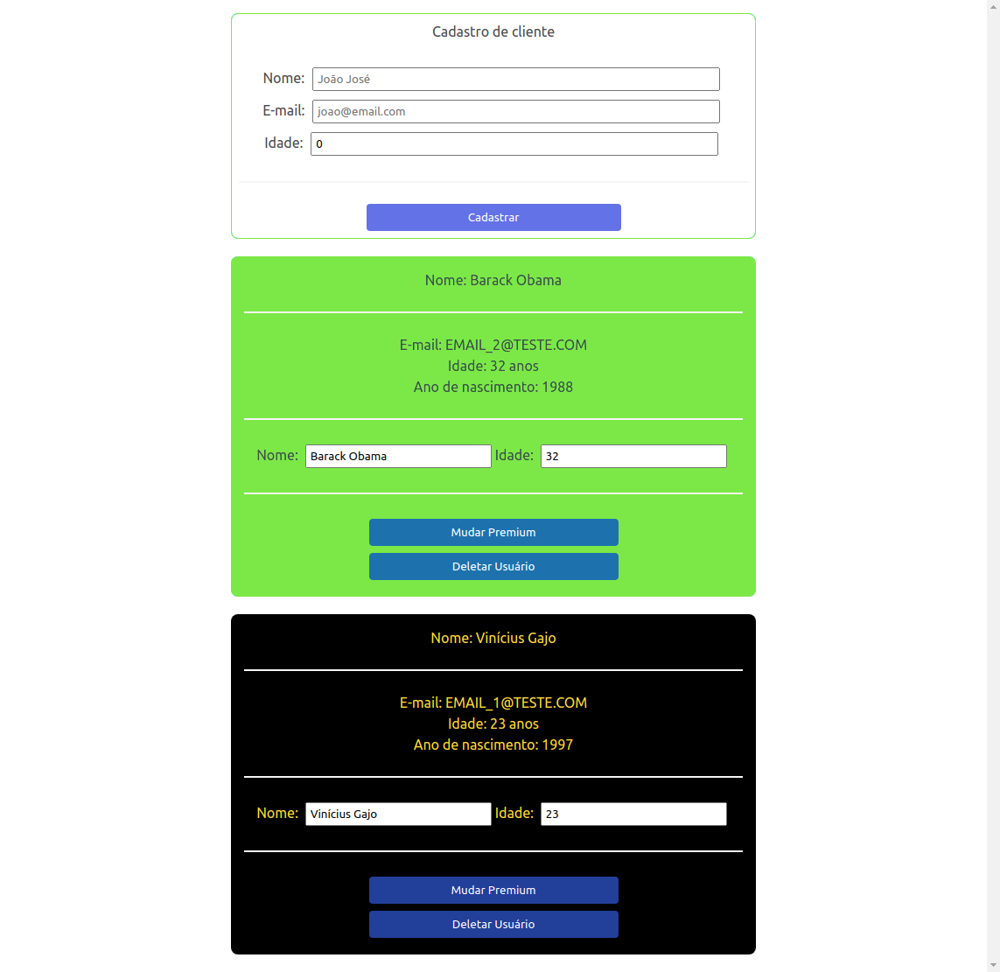
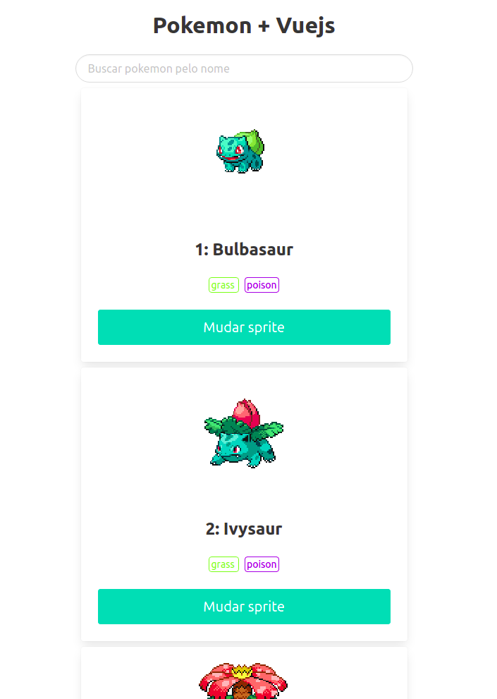

# Códigos do curso de Vue JS - Guia do Programador

Neste repositório podem ser encontrados os códigos criados ao longo do Curso de Vue JS, do canal Victor Lima - Guia do Programador, no YouTube compartilhado de maneira gratuita, além de outros códigos de projetos que estou desenvolvendo separadamente para estudar a ferramenta.

Nas aulas do canal do Victor Lima foi apresentado o funcionamento do Vue através de exemplos práticos. 

Lidamos com:

* Gestão de estados (*data*);
* Emissão de eventos customizados; 
* Componentização, que favorece a reutilização de códigos; 
* Passagem de *props* para componentes específicos;
* Filtros customizados, que transformam apenas a apresentação das informações;
* *Computed properties*, que é um recurso para realmente transformar dados, podendo criar novas propriedades;

**Dica:**

Como criar um projeto com o boilerplate padrão do Vue js (semelhante ao obtido executando o create-react-app):

```bash
# cria o boilerplate do projeto
npx @vue/cli create <nome_do_projeto>
```

## Aplicações

### Primeira aplicação

A primeira aplicação foi criada para mostrar os conceitos mais básicos do Vue. Nela nós não nos preocupamos com detalhes estéticos, focando apenas em apresentar a estrutura do código e possibilidades da ferramenta.

A imagem abaixo ilustra a aplicação, que consiste num sistema de gestão de clientes, onde são salvados o { nome, email, idade }, posteriormente acrescentando os valores de id e uma variável booleana para indicar se o usuário é *premium* ou não.

O resultado pode ser visto na imagem abaixo.

<span style="display: block; text-align: center;">
  
</span>

### Segunda aplicação

Já na segunda aplicação iremos criar uma Pokedex consumindo os dados de uma API pública que fornece os dados de todos os Pokemons. Para fazer as requisições é utilizado o *axios* e para facilitar a estilização da página estamos utilizando o framework conhecido como *bulma*.

O resultado deste projeto pode ser visto na imagem abaixo.

<span style="display: block; text-align: center;">
  
</span>

### Terceira aplicação

Continuando no pique resolvi criar outras aplicações para ir me acostumando com o Vue.js. A terceira aplicação que decidi criar foi o clone na *landing page* do próprio site do Vue.

### Quarta aplicação

A quarta aplicação criada foi um sistema desenvolvido para entender o *Vuetify* e *Vuex*, sendo o primeiro um framework que fornece um conjunto de componentes já criados e estilizados, facilitando e agilizando o desenvolvimento de novas aplicações, além de garantir um estilo único para projetos com muitos integrantes e o segundo uma ferramenta utilizada para garantir uma manipulação de estados de forma mais organizada e centralizada.

O objetivo com este projeto é criar um *TO-DO App*, ou seja, uma aplicação para listar tarefas e posteriormente marcar as já finalizadas (sim... muito criativo haha).

Embora o algoritmo seja bastante simples, o objetivo ao desenvolver essa aplicação é apenas estudar os frameworks *Vuetify* em conjunto com o *Vuex*, como mencionado anteriormente.

O resultado deste projeto pode ser visto na imagem a seguir.

<span style="display: block; text-align: center;">
  
</span>

Finalizando este projeto foram desenvolvidos testes automatizados para o projeto, utilizando o *Jest* para executá-los.

Foram criados vários testes unitários, que são basicamente testes de componentes individualmente. Segundo a referência [12], alguns dos benefícios desse tipo de testes são:

- Verificar se os componentes funcionam corretamente;
- Prover documentação (dinâmica) da aplicação;
- Facilita o processo de *debug*, pois fica mais fácil encontrar os problemas com a execução dos testes;
- Diminui a quantidade de *bugs*.

No momento ainda não criei nenhum projeto utilizando a metodologia *TDD* conforme apresentado pela referência [13], porém é o próximo passo na trajetória de aprendizado abordada neste projeto.

*Observação: Os testes não devem cobrir 100% do código pois isto irá torná-lo frágil. O ideal é testar apenas as entradas e saídas de um determinado componente, sem levar em consideração a lógica interna. A pergunta que define se algo deve ser testado ou não é: 'Do I care about this if it changes?' [13]*

## Referências:

Abaixo segue uma lista com todas as referências utilizadas e consumidas para a realização destes projetos na trajetória de aprendizado sobre Vue.js.

[1] - [Playlist com as aulas do curso no YouTube](https://www.youtube.com/watch?v=npA_f0ztIt0&list=PLJ_KhUnlXUPteacVhunyK5M8SKIadeED0)

[2] - [Vue.js Guide](https://vuejs.org/v2/guide)

[3] - [How to Get Started with Vuetify](https://www.sitepoint.com/get-started-vuetify/)

[4] - [Vuetify Material Framework in 60 minutes | From Scratch to Pro in Vuetify Vuejs](https://www.youtube.com/watch?v=GeUhmMJUFZQ&ref=madewithvuejs.com)

[5] - [Top Vuetify Tutorials](https://madewithvuejs.com/blog/top-vuetify-tutorials)

[6] - [What is Vuex?](https://vuex.vuejs.org/#what-is-a-state-management-pattern)

[7] - [Vuex course on Scrimba](https://scrimba.com/g/gvuex)

[8] - [How to Test Your Vue Components Using the Jest Testing Framework](https://www.digitalocean.com/community/tutorials/vuejs-vue-testing)

[9] - Testing Vue.js Applications, *Edd Yerburgh*.

[10] - [Vue Test Utils - Guides](https://vue-test-utils.vuejs.org/guides/#common-tips)

[11] - [Vue NYC - Component Tests with Vue.js - Matt O'Connell](https://www.youtube.com/watch?v=OIpfWTThrK8)

[12] - [Edd Yerburgh - Unit testing Vue components Why test, what to test, and how to test Vue components](https://www.youtube.com/watch?v=LxXsGNXsMo8)

[13] - [Test driven development with Vue.js by Sarah Dayan](https://www.youtube.com/watch?v=DD1fEhcEzY8)

---
Vinícius Gajo Marques Oliveira, 2020.