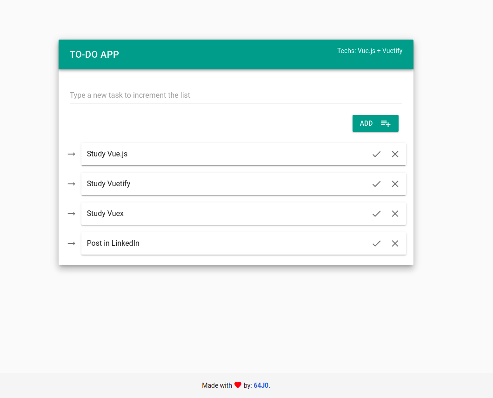
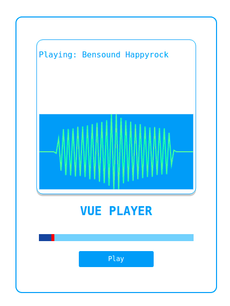

# Estudos em Vue.js

Neste repositório podem ser encontrados os códigos de alguns projetos que estou desenvolvendo para aprender o framework Vue.js. 

Os primeiros projetos criados foram versões customizadas dos apresentados ao longo do Curso de Vue JS, do canal Victor Lima - Guia do Programador, no YouTube compartilhado de maneira gratuita, porém, posteriormente decidi explorar por conta própria com projetos diferentes.

Nas aulas do canal do Victor Lima foi apresentado o funcionamento do Vue através de exemplos práticos. 

Lidamos com:

* Gestão de estados (*data*);
* Emissão de eventos customizados; 
* Componentização, que favorece a reutilização de códigos; 
* Passagem de *props* para componentes específicos;
* Filtros customizados, que transformam apenas a apresentação das informações;
* *Computed properties*, que é um recurso para realmente transformar dados, podendo criar novas propriedades;

**Dica:**

Como criar um projeto com o boilerplate padrão do Vue js (semelhante ao obtido executando o create-react-app):

```bash
# cria o boilerplate do projeto
npx @vue/cli create <nome_do_projeto>
```

A medida que vou estudando mais sobre o universo desta ferramenta vou tentando aplicar estes conceitos na prática para fixar as informações. Para saber mais sobre as aplicações desenvolvidas basta ler o restante deste documento que contém um resumo de cada projeto.

---

## Aplicações

### Primeira aplicação *1-guiaclientes*

A primeira aplicação foi criada para mostrar os conceitos mais básicos do Vue. Nela nós não nos preocupamos com detalhes estéticos, focando apenas em apresentar a estrutura do código e possibilidades da ferramenta.

A imagem abaixo ilustra a aplicação, que consiste num sistema de gestão de clientes, onde são salvados o { nome, email, idade }, posteriormente acrescentando os valores de id e uma variável booleana para indicar se o usuário é *premium* ou não.

O resultado pode ser visto na imagem abaixo.

<div style="text-align: center;">
  
</div>

### Segunda aplicação *2-pokedex*

Já na segunda aplicação iremos criar uma Pokedex consumindo os dados de uma API pública que fornece os dados de todos os Pokemons. Para fazer as requisições é utilizado o *axios* e para facilitar a estilização da página estamos utilizando o framework conhecido como *bulma*.

O resultado deste projeto pode ser visto na imagem abaixo.

<div style="text-align: center;">
  
</div>

### Terceira aplicação *3-estudo-vue*

A terceira aplicação criada foi um sistema desenvolvido para entender o *Vuetify* e *Vuex*, sendo o primeiro um framework que fornece um conjunto de componentes já criados e estilizados, facilitando e agilizando o desenvolvimento de novas aplicações, além de garantir um estilo único para projetos com muitos integrantes e o segundo uma ferramenta utilizada para garantir uma manipulação de estados de forma mais organizada e centralizada.

O objetivo com este projeto é criar um *TO-DO App*, ou seja, uma aplicação para listar tarefas e posteriormente marcar as já finalizadas (sim... muito criativo haha).

Embora o algoritmo seja bastante simples, o objetivo ao desenvolver essa aplicação é apenas estudar os frameworks *Vuetify* em conjunto com o *Vuex*, como mencionado anteriormente.

O resultado deste projeto pode ser visto na imagem a seguir.

<div style="text-align: center;">
  
</div>

Finalizando este projeto foram desenvolvidos testes automatizados para o projeto, utilizando o *Jest* para executá-los.

Foram criados vários testes unitários, que são basicamente testes de componentes individualmente. Segundo a referência [12], alguns dos benefícios desse tipo de testes são:

- Verificar se os componentes funcionam corretamente;
- Prover documentação (dinâmica) da aplicação;
- Facilita o processo de *debug*, pois fica mais fácil encontrar os problemas com a execução dos testes;
- Diminui a quantidade de *bugs*.

No momento ainda não criei nenhum projeto utilizando a metodologia *TDD* conforme apresentado pela referência [13], porém é o próximo passo na trajetória de aprendizado abordada neste projeto.

*Observação: Os testes não devem cobrir 100% do código pois isto irá torná-lo frágil. O ideal é testar apenas as entradas e saídas de um determinado componente, sem levar em consideração a lógica interna. A pergunta que define se algo deve ser testado ou não é: 'Do I care about this if it changes?' [13]*

### Quarta aplicação *4-vue-audio*

Nesta quarta aplicação estou desenvolvendo um player customizado de audio utilizando os componentes disponibilizados por padrão pelo HTML + JavaScript do Browser.

O objetivo deste projeto é avaliar a realização de testes em situações mais incomuns, além de entender como funcionam as funcionalidades de Audio do Chrome.

Para desenvolver o canvas com a visualização dos dados da reprodução de música foi utilizado como principal inspiração a referência [18].

<div style="text-align: center;">
  
</div>

**Estudo sobre a referência [18]:**

Neste projeto encontrei pela primeira vez o componente **mixin**, que a ideia é relativamente parecida com a de uma *store* (*Vuex*). Este componente de **mixin** está no caminho */src/components/AvBase.js* do repositório do projeto. A ideia principal do **mixin** é fornecer uma base que pode ser reutilizada em outros componentes do projeto.

Neste componente específico é instanciado um elemento de audio (*HTML*), é setada a propriedade *src*, define se o elemento terá a propriedade *crossorigin="anonymous"*.

Além disso também é instanciado o *canvas* que conterá toda informação visual a respeito do áudio sendo tocado no *player*. É configurada a *width*, a *height* e a *fillColor* deste componente a partir das informações passadas por props para o componente.

Continuando, após instanciar estes elementos, este componente é responsável por setar o *analyser* e conectar com a tag de audio instanciada anteriormente, associando vários eventos a este elemento e criando a função que será executada para desmontar o elemento e retirar o analyser, evitando que a página fique processando indefinidamente.

O gráfico que decidi implementar neste projeto até então foi o *AvLine*, que pode ser encontrado no caminho *src/components/AvLine.js*. Neste componente são definidos os detalhes da exibição no canvas dos dados do áudio sendo tocado, por exemplo a *lineWidth*, *lineColor* e o *fftSize*.

No corpo do componente são definidas algumas funções, por exemplo, o *mainLoop()*, que configura os dados obtidos a partir do *analyser*, são configuradas as informações obtidas a partir das props no elemento de *canvas*.

Além disso também são definidas as funções "privadas" *_setCanvas()* e *_drawLine()* que são responsáveis por fazer configurações internas na função principal *mainLoop()*.

---
## Test Coverage - Explicação dos termos

Esta seção deste documento foi totalmente baseada nos tópicos da referência [14], onde são abordados justamente os conceitos do *test coverage* do *Jest*.

- **Function coverage:** Todas as funções (ou subrotinas) no programa foram chamadas?
- **Statement coverage:** Todas as instruções do programa foram executadas?
- **Branch coverage:** Todos os ramos (também chamados *DD-path*) de todas as estruturas de controle (como as instruções *if* ou *case*) foram executados? Por exemplo, dada uma instrução, tanto o ramo relacionado ao estado *true* quanto o ramo relacionado ao estado *false* foram percorridos?
- **Line coverage:** Todas as linhas executáveis no arquivo fonte foram executadas?

---
## Referências:

Abaixo segue uma lista com todas as referências utilizadas e consumidas para a realização destes projetos na trajetória de aprendizado sobre Vue.js.

[1] - [Playlist com as aulas do curso no YouTube](https://www.youtube.com/watch?v=npA_f0ztIt0&list=PLJ_KhUnlXUPteacVhunyK5M8SKIadeED0)

[2] - [Vue.js Guide](https://vuejs.org/v2/guide)

[3] - [How to Get Started with Vuetify](https://www.sitepoint.com/get-started-vuetify/)

[4] - [Vuetify Material Framework in 60 minutes | From Scratch to Pro in Vuetify Vuejs](https://www.youtube.com/watch?v=GeUhmMJUFZQ&ref=madewithvuejs.com)

[5] - [Top Vuetify Tutorials](https://madewithvuejs.com/blog/top-vuetify-tutorials)

[6] - [What is Vuex?](https://vuex.vuejs.org/#what-is-a-state-management-pattern)

[7] - [Vuex course on Scrimba](https://scrimba.com/g/gvuex)

[8] - [How to Test Your Vue Components Using the Jest Testing Framework](https://www.digitalocean.com/community/tutorials/vuejs-vue-testing)

[9] - Testing Vue.js Applications, *Edd Yerburgh*.

[10] - [Vue Test Utils - Guides](https://vue-test-utils.vuejs.org/guides/#common-tips)

[11] - [Vue NYC - Component Tests with Vue.js - Matt O'Connell](https://www.youtube.com/watch?v=OIpfWTThrK8)

[12] - [Edd Yerburgh - Unit testing Vue components Why test, what to test, and how to test Vue components](https://www.youtube.com/watch?v=LxXsGNXsMo8)

[13] - [Test driven development with Vue.js by Sarah Dayan](https://www.youtube.com/watch?v=DD1fEhcEzY8)

[14] - [How to read Test Coverage report generated using Jest](https://medium.com/@krishankantsinghal/how-to-read-test-coverage-report-generated-using-jest-c2d1cb70da8b)

[15] - [Visualizations with Web Audio API](https://developer.mozilla.org/en-US/docs/Web/API/Web_Audio_API/Visualizations_with_Web_Audio_API)

[16] - [How to build a SoundCloud-like audio player app with VueJS, Quasar and WaveSurfer](https://www.learningsomethingnew.com/how-to-build-a-sound-cloud-like-audio-player-app-with-vue-js-quasar-and-wave-surfer)

[17] - [Building an Audio Visualizer With JavaScript](https://medium.com/swlh/building-a-audio-visualizer-with-javascript-324b8d420e7)

[18] - [vue-audio-visual](https://github.com/staskobzar/vue-audio-visual)

---
Vinícius Gajo Marques Oliveira, 2020.